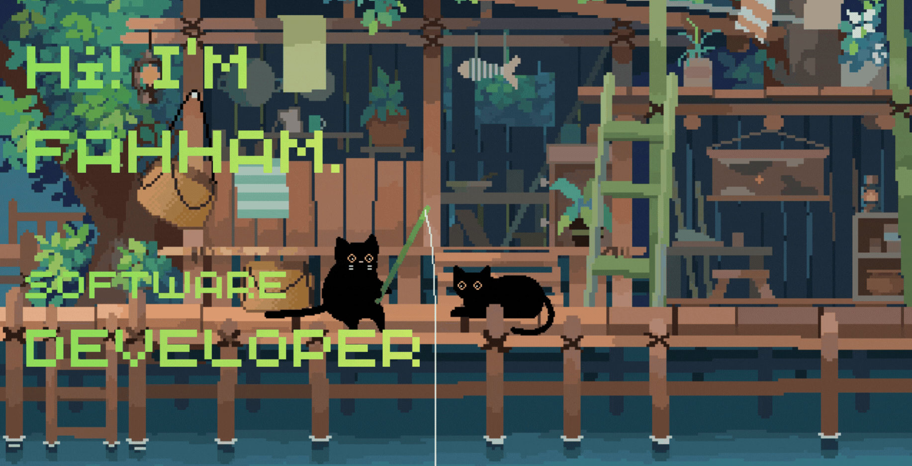
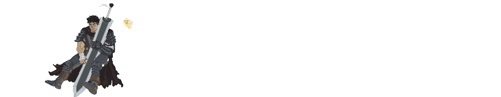

<!-- =========================
         HEADER BANNER
========================= -->

  

<h2 align="center">Hello there, fellow &lt;coder /&gt;! 👋</h2>

---

<!-- =========================
   RIGHT IMAGE (FLOAT STYLE)
========================= -->

> [!CAUTION]
> ⚡ Congratulations you found me

> [!NOTE]
> 💻 Application Developer (Apprentice)

> [!IMPORTANT]
> 📚 I’m currently learning **Blockchain technology**

> [!WARNING]
> 💪 Future Goal: Keep improving and mastering new technologies

> [!TIP]
> 🤝 If you’re interested in collaborating — I’d love to hear from you!

 

---

  

---

## 🚀 Tech Stack & Toolbox

### 💙 What I enjoy working with the most

  

---

### 🛠️ Technologies I've used so far

  

---

### 👀 Currently exploring

  

---

### 🎨 Other Skills

  
  
  
  
  
  

---

  

---

  
  
  

  
  
  

